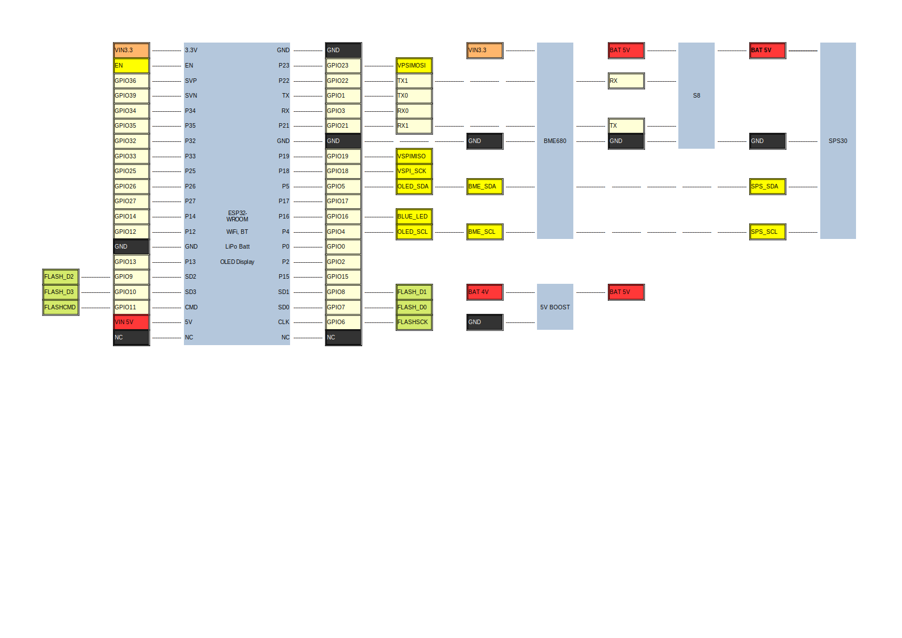

# AqiSensor
Air Quality Sensor based on ESP32-WROOM-32 with built-in SSD1306 OLED display and Li-ion battery, complemented with a Bosch BME680, AirSense S8 and Sensirion SPS30 sensors to measure:
- temperature
- humidity
- barometric pressure
- volatile organic compounds
- CO2 concentration
- particulate matter

It shows the time, date, measured temperature, pressure, humidity, CO2 and calculated air quality index on the display. It also sends this data every minute via MQTT over WiFi to an home automation platform.
## Usage
At first start-up, the module will act like a WiFi Access Point. Search for the AQIs-sensor SSID and connect your device (e.g. smartphone) to it. It will present you with a configuration menu. It will ask for:
- WiFi SSID
- WiFi password
- MQTT hostname
- MQTT port
- Publish topic to publish the measurements
- Subscribe topic to obtain the time of day

When WiFi network establishement is successful, these parameters will be stored on the internal flash memory of the ESP32. When the module is rebooted, these parameters will be retrieved. When the WiFi network can be reached, the unit will operate. If not, you need to configure the paramaters again.

## Libraries used in this project:
- Adafruit BME680 Library, version 2.0.2
- Adafruit BusIO, version 1.14.1
- Adafruit GFX Library, version 1.11.5
- Adafruit SSD1306, version 2.5.7
- Adafruit Unified Sensor, version 1.1.9
- Arduinojson, version 6.21.2
- AsyncMQTT_ESP32, version 1.10.0
- AsyncTCP, version 1.1.4, see note 1
- AsyncTCP_SSL, version 1.3.1, see note 1
- ESP8266 and ESP32 OLEDdriver for SSD1306 displays, version 4.4.0
- PubSubClient, version 2.8
- Time, version 1.6.1
- WebServer_ESP32_ENC, version 1.5.3, see note 1
- WebServer_ESP32_SC_ENC, version 1.2.1, see note 1
- WebServer_ESP32_SC_W5500, version 1.2.1, see note 1
- WebServer_ESP32_SC_W6100, version 1.2.1, see note 1
- WebServer_ESP32_W5500, version 1.5.3, see note 1
- WebServer_ESP32_W6100, version 1.5.3, see note 1
- WebServer_ESP32_ETH01, version 1.5.1, see note 1
- WifiManager, version 2.0.16-rc.1
- Sensirion-SPS, version 1.1.0

note 1: Installed automatically when installing AsyncMQTT_ESP32 library via the Arduino Library manager.

## Hardware setup
The sensor is built around the ESP32 based module ESP32-WROOM with OLED display (I2C address: 0x3C) and LiPo battery. Added are the sensors:
- Bosch BME680 on a module that include level shifters (I2C address: 0x77)
- SenseAir S8 (Modbus over UART)
- Sensirion SPS30 (I2C address: 0x69)
- LiPo to USB Boost converter to provide 5V

The Power on/off switch on the ESP32 module is replaced by a double-pole double-throw switch that not obnly switches the ESP32 module butr also switches the 4.2V from the battery to the boost converter module.

The Sensirion S8 is interfacing via UART (RX2/TX2); the other sensors use I2C.
See details: 
